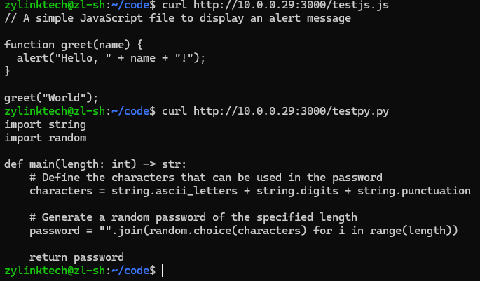
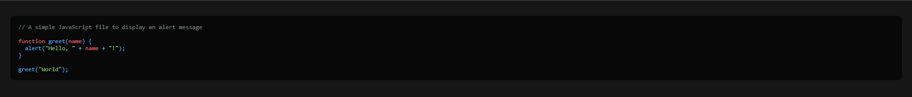
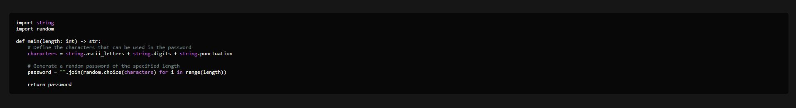

# code-webview
a lightweight node.js express server for viewing code in the browser with curl support

## dependencies 
```
sudo apt update
sudo apt install nodejs npm -y
```

## setup
```
cd /path/to/project
npm init -y
npm install express highlight.js
```

## running
download `index.js` to your project folder
```
node index.js
```

## preview



